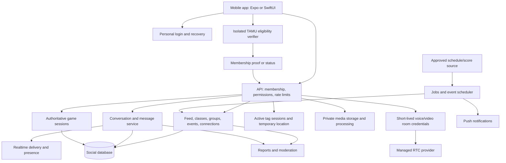

# MaroonSocial — proposed architecture

> **October 4 product update:** The current requirement replaces anonymous random text/voice matching with a visible username-and-interests lobby, explicit connection requests and mutual acceptance before text/video. Anonymous post/reply DMs remain. Group nicknames are separate per room. Email/TAMU delivery and paid advertising are paused by the owner; direct video has no paid relay. [Feature status](FEATURE-STATUS.md) and [verification](TESTING.md) describe the implemented behavior and remaining limits; the proposals below are historical where they differ.

> **October 1, 2026 implementation update:** Coding is now authorized. The user selected SwiftUI, iPhone first, and connected Supabase **Maroon Social** plus GitHub **VishalKothuri/MaroonSocial**. Mascot work is paused. This document preserves the earlier research/proposals; its older no-code statements are historical. See [README](README.md) for tested implementation status and remaining work.

September 29, 2026 • Discussion draft • No implementation authorized.

Technical choices remain recommendations. Confirmed direction: one unified username across named features, required in ordinary class chats; one course chat per semester; random matching essential; 18+ access; tag first for design, with credential binding deferred. Stronger identity privacy and ban persistence are targets, not solved guarantees. Exact email domains, platforms, retention and launch scope remain open. No application coding is authorized. Evidence and provider pricing are in [the research brief](RESEARCH.md).

## System shape

Use a modular backend rather than a separate microservice for every feature. Isolate verification and recovery credentials because their access rules differ from social content. Treat the boxes below as responsibility boundaries; they do not each require a separate paid server.

Candidate low-cost stack: Expo/React Native mobile client; a TypeScript API; managed Postgres; an authenticated realtime room layer; private object storage; queue/scheduler; transactional email; and a managed RTC service. Cloudflare Workers/R2 plus Neon is one evaluated combination, not a final selection. Realtime fanout requires an explicit service or stateful room design and its own capacity/cost evaluation. Firebase is an alternative with strong realtime primitives; its read/write/listener billing needs workload modeling. The relational membership, permissions, votes, and event model makes Postgres my preferred starting point. [Firestore billing](https://firebase.google.com/docs/firestore/pricing).

## Account, eligibility, and identity are separate

**Private account:** persistent random account identifier, login/recovery credentials, security state, block relationships, membership validity. Never return this universal identifier in public content payloads.

**Eligibility:** what was checked, campus scope if actually attested, verification/expiry time, and revocation state. A mailbox check should not be silently upgraded to current-student proof.

**Public username:** one chosen username/icon across classes, study, recreation, tag, gaming, named community posts, and named DMs. This consistency intentionally makes named activity recognizable. It does not make private course or activity memberships public.

**Anonymous discussion identity:** proposed per-thread display markers and OP indicators for anonymous community posts/replies; no public link to the unified profile. The original optional-anonymous feed requirement is retained pending confirmation that “one username for everything” changes only named features. Anonymous-origin DMs must preview whether accepting retains the discussion identity or explicitly shares the unified username. Do not reveal it silently.

Blocks and bans act on a stable underlying membership/account, independent of username changes. Public profiles must not expose anonymous posts, private memberships, email, or the stable enforcement identifier. Opening the username editor changes the single public name rather than creating section aliases.

### Comparison only — practical verification option A (insufficient for the stronger target)

1. Verify personal email and establish a restricted account. It has no campus content access yet.
2. Explain exactly what school verification does and retains.
3. Submit the school email directly to an isolated verifier. Enforce an exact domain allowlist server-side. Do not accept arbitrary .edu, suffix lookalikes, or arbitrary TAMU-system domains.
4. Generate a short-lived, single-use email challenge, bound to the initiating account/session and email. Limit attempts and resends. Store a protected code verifier and temporarily encrypted delivery address with a strict expiry; redact both from application/APM logs.
5. Check the returned challenge atomically. A duplicate-detection HMAC may be stored behind a separate key/access boundary. Canonicalization must reflect TAMU's actual alias rules; do not strip punctuation or plus-addressing based on assumptions.
6. Issue a short-lived, audience-bound, replay-protected membership grant. The app records eligibility status and expiry, not the raw school email.
7. Delete temporary school-email/challenge data after success or expiry. Verify queues, error traces, provider logs, backups, and suppression records before making retention promises.
8. Expired eligibility leads to re-verification; access changes follow the chosen graduation policy. Login recovery alone cannot manufacture a fresh university entitlement.

Option A is pseudonymous to the operator because personal-email login and the account remain linked. Retaining an HMAC prevents some repeat registrations but does not prove one account per human: mailbox aliases, shared accounts, and multiple eligible addresses must be considered. The school-email record should never be copied into the ordinary authentication provider's user profile.

### Target direction — stronger separation, privacy option B

Replace the account-bound school grant with reviewed blind issuance and separate redemption. The verifier should not see the app's stable account ID. Keep issuance metadata coarse and avoid shared correlation IDs, analytics, or tracing across the boundary. Redemption must reject replays.

The proposed stable membership marker, login-key binding, and ban-preserving renewal/recovery are detailed in [the privacy update](TAG-AND-PRIVACY-UPDATE.md). This remains an unevaluated design, not a solved cryptographic protocol. Ordinary bearer tokens can be transferred. One-time tokens alone do not provide persistent membership, renewal, credential recovery, or bans. Decide how to bind possession, limit issuance, revoke abuse, and restore a lost device without rejoining the identities. A mandatory personal-email login remains a separate operator-identification path unless that relationship is also redesigned. Do not ship custom cryptography without specialist review.

## Data responsibilities

| Domain | Main records | Access rule |
|---|---|---|
| Identity | Login credentials, recovery factors, sessions | Authentication service only; separate from content moderation |
| Eligibility | Temporary challenges, protected duplicate markers, grants | Verifier only; minimum proof to app |
| Membership | Account, eligibility kind, campus, validity, suspension | Checked on API and socket authorization |
| Personas | Account/context association, name, avatar, revision | Only context-safe projections leave server |
| Feed | Posts, comments, votes, bookmarks, visibility, author context | Eligible campus members; own-content controls |
| Courses | Campus, subject, number, term; optional section | Catalog is public metadata; memberships are private |
| Rooms | Type, membership, roles, invite policy, state | Membership and role checks on every mutation |
| Messages | Conversation, sequence, sender persona, reply target, attachment | Authorized participants; separate moderation access |
| Activities | Type, time, place, capacity, host, RSVP, linked room | Participant/host privileges; location visibility rule |
| Connections | Named profile endpoints, invitation, acceptance, consent | Mutual, access-controlled visibility |
| Games | Invitation, rules version, turn, state, actions, result | Server validates participant, version, and legal move |
| Tag | Match, role, boundary, hint cadence, temporary location | Active match only; never public campus tracking |
| Sports | Provider event ID, time/version, state, scores, last update, room | Shared cached record; scheduler owns state transitions |
| Safety | Reports, evidence, decisions, appeals, audit trail | Restricted moderators; separate from login identities |

Postgres schemas are organizational boundaries, not automatically security boundaries. Separate roles, keys, credentials, and where justified databases/projects are needed to enforce the proposed separation.

## Feed and class behavior

Serve New chronologically and propose Hot using time decay and abuse-resistant voting. A user has one vote per item. Ranking math and deletion threshold are open; downvotes are not a substitute for moderation.

Every post locks its authorship context at creation. Replying inside an anonymous thread maintains a discussion-specific persona and OP marker. Publishing under a community handle does not attach past anonymous activity to its profile. Deletion replaces the public body with a tombstone where replies depend on it; evidence and backup retention must match the adopted policy.

Create one course-general room per campus/course/term, as confirmed. Selecting CHEM 107 joins its existing room atomically rather than creating duplicates. Do not split the initial room by instructor or section. A new semester should not silently reveal old class memberships to new students.

Study-group records include course, subject/topic, availability, meeting mode, capacity, location disclosure, recurring status, and join approval. Do not publish a full student schedule or cross-course membership profile.

## Messaging, media, groups, and connections

Message lifecycle: local pending → accepted by server with unique ID/sequence → delivered to authorized room → recipient notification. Retries use idempotency keys; reconnect loads missing messages rather than duplicating them. Typing/presence expire quickly and do not belong in permanent message history.

DM lifecycle: source-context permission check → one request → accept/decline/block → normal conversation. Proposed default: no images, calls, or game spam before acceptance. A blocked, expired, or suspended member cannot continue sending through an already-open socket.

Images go through authenticated upload, size/type validation, metadata stripping, scanning/moderation, and private storage. Serve short-lived authorized media URLs; a guessed conversation/attachment ID grants nothing. For memes, start with user uploads and original templates. A GIF search provider adds SDK, licensing, cost, and privacy considerations and remains unselected.

Shared chat controls: reply, react, copy, delete own message under the selected policy, report, and block. DMs are not described as end-to-end encrypted unless a vetted E2EE protocol, multi-device keys, recovery, attachment encryption, and user-submitted report evidence are actually implemented. If operator-readable storage is selected, disclose that clearly.

Private groups require invite acceptance and the unified username. Suggested roles are owner, moderator, member; include owner transfer, member removal, invitation revocation, and leave. A user's public profile should not expose all private groups. Friendship is proposed as a mutual connection between named profiles, without exposing anonymous activity. Whether friendship exists at launch is open.

## Turn-based games

Cup pong and 8-ball should use a common game-session shell, but have independent rules and physics modules. No GamePigeon integration or reusable assets were verified.

| Shared lifecycle | Behavior |
|---|---|
| Invite | Choose game/opponent/rules; post an invitation card |
| Accept | Lock participants, rule version, and initial state |
| Play | Open game view from chat; show turn and objective |
| Submit | Send input such as aim/power/spin; server validates and resolves |
| Replay | Other player sees the same authoritative result |
| Continue | Return to chat; notify opponent only when appropriate |
| Finish | Win/loss/draw/forfeit; rematch requires acceptance |

For cup pong, define cups, hit detection, bounce rules, turn count, and aim/power constraints before implementation. For 8-ball, define break, solids/stripes assignment, fouls, ball-in-hand, called-pocket behavior, and early 8-ball outcomes. Prefer an explicitly chosen casual rule set over vaguely claiming tournament rules.

Use server-owned state with versioned actions and collision/rule validation. Client-submitted winner or final ball positions are not authoritative. Cross-platform floating-point differences require canonical server results or a tested deterministic simulation. Asynchronous turns reduce continuous network cost, but polished physics, touch controls, animations, sound, accessibility, and cheating resistance remain significant development work.

For a low-cost first game, Four in a Row or another simple original turn-based game exercises the invitation/reconnect/turn infrastructure before physics games. This sequence is proposed, not a removal of cup pong or 8-ball.

## Activities, location, and calls

Recreation and study activities share scheduling/capacity/chat machinery and the unified username; private membership lists remain access-controlled. Joining the final slot must be atomic; waitlist promotion and cancellation notify the affected people. Use public meeting places and explicit detail visibility.

Tag has a separate temporary location pipeline. The server calculates permitted hints; clients cannot query arbitrary users or all campus coordinates. Stop collection on leave/end/expiry and delete stale updates. Permission denial, inaccurate/stale GPS, app termination, battery restrictions, lost connectivity, boundary exit, host departure, and suspected spoofing are first-class states. No feature should silently turn location sharing back on.

Voice/video uses short-lived, room-bound provider credentials issued only after participant and block checks. Admission, room size, join expiry, duration cap, removal, and budget limits are server-controlled. Microphone/camera are requested when entering the feature, not during campus onboarding. Use explicit call acceptance, mute, route selection, camera control, and end-call controls. Background audio and incoming-call behavior need native device testing.

Gaming hangouts can initially be teammate discovery: game title, platform, skill/intent, available slots, start time, text lobby, and optional voice party. External game handles are disclosed deliberately. Actually streaming games, screen sharing, or hosting third-party game clients is a distinct, more expensive scope. Your meaning is still open.

## Sports room scheduling

Store canonical UTC start time, sport, participants, external event ID, provider freshness, and schedule version. Display campus time with an explicit timezone when useful.

Proposed lifecycle: scheduled → pregame chat open at start minus 30 minutes → in progress → final/postgame → archived. Closing interval is open. Postponed/cancelled/time-TBD states override the normal countdown.

A server scheduler, not a phone timer, controls opening. Each job checks the latest schedule version and performs an idempotent transition. Rescheduling invalidates stale jobs and updates reminders. If the room already opened, keep history and display the schedule change rather than silently deleting it. Use a reconciliation job to catch missed transitions after outages. Doubleheaders and rescheduled games require stable provider IDs, not opponent/date alone.

Poll an approved score feed once per event and fan out cached updates. Show last-updated state; never label a stale score live. A fixture without a confirmed start time gets no invented countdown. Every included TAMU game gets its room even if live-score coverage is unavailable; show the supported schedule/official-link fallback.

## Moderation and operation

Reports must be reachable from posts, replies, messages, personas, activity listings, and live sessions. Route high-severity reports to a staffed queue; provide appeals and audit access. Use spam limits, content filtering, upload checks, report review, and anti-brigading controls. Do not expose reporter identity. Platform requirements apply to a school-only app too. [Google UGC policy](https://support.google.com/googleplay/android-developer/answer/9876937), [Apple guideline 1.2](https://developer.apple.com/app-store/review/guidelines/).

Account suspension invalidates sessions, room access, pending invitations, call tokens where revocable, and active tag participation. Existing signed media URLs need appropriately short expiry. An account-wide ban is easy to represent internally; preventing every new identity from rejoining is a separate challenge, especially under unlinkable membership.

Record aggregate adoption, message delivery failures, verification success, moderation turnaround, and resource usage. Do not send emails, message bodies, full locations, or universal identity mappings into third-party analytics. Push notifications default to neutral previews to reduce lock-screen disclosure.

Define retention before launch for raw verification data, duplicate markers, messages, reports, IP/security logs, media, backups, and location. The raw school email can have a short technical expiry, but the overall promise must include processors. Account deletion must revoke access, stop location/calls, cancel activity obligations or transfer ownership, remove eligible data, and explain any narrowly retained evidence. Retention numbers remain undecided.

## Validation needed after coding is authorized

- Privacy review: attempt anonymous-to-named identity linkage through APIs, IDs, avatars, timestamps, profiles, push notifications, games, and merged DMs.
- Eligibility tests: wrong domain, alias duplication, OTP guessing/replay, expired proof, switched account, and suspended membership.
- Access tests: a non-member cannot read a room, attachment, location hint, or call credential; removal works on live connections.
- Reliability: duplicate sends, offline recovery, room capacity races, invite revocation, simultaneous game turns, rescheduled sports jobs.
- Device field tests: iOS/Android permission denial, locked screen, backgrounding, force-quit, GPS drift, compass calibration, and low connectivity.
- Cost tests: game-day fanout, reconnect storms, long voice rooms, upload abuse, and enforced quota exhaustion.

No tests have been run because no application has been built. This is the validation plan, not a claim of verified implementation.

## Latest social feature extensions

Add Hangouts to shared activities; verified organizational publishers with private administrative roles; a separately authorized optional 18+ non-explicit community; and server-enforced single-media messages. The detailed data boundaries and authorization behavior in [the social additions specification](SOCIAL-ADDITIONS.md) extend this architecture. Organization bylines are a public entity identity, not an exception that reveals personal administrator profiles.
