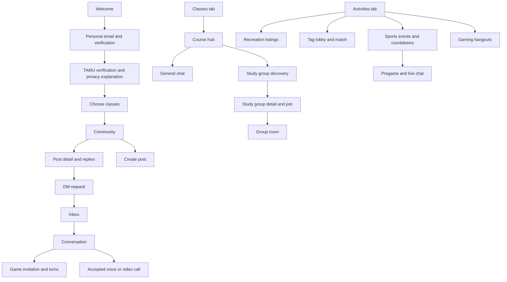

# MaroonSocial — screen design and navigation specification

> **October 1, 2026 implementation update:** Coding is now authorized. The user selected SwiftUI, iPhone first, and connected Supabase **Maroon Social** plus GitHub **VishalKothuri/MaroonSocial**. Mascot work is paused. This document preserves the earlier research/proposals; its older no-code statements are historical. See [README](README.md) for tested implementation status and remaining work.

September 29, 2026 • Supporting navigation specification • No UI code or interactive prototype.

For the visual screen boards, open [the design gallery](design/GALLERY.md).

The layouts below are reviewable screen structures, not final artwork. Labels, tab count, color direction, and defaults are proposed. Open product choices are marked; no mock copy claims current-student verification when only email ownership is checked.

## Navigation proposal

Four permanent tabs: **Community · Classes · Activities · Inbox**. Put personal settings/identities behind the top-right account button, and notifications behind a bell. This keeps sports, tag, recreation, and gaming reachable without seven competing bottom tabs. Random matching is required and has an Activities entry in the concept; its distribution route remains open.

Each tab retains its navigation stack, scroll position, filters, and unsent draft. Detail pages have Back. Full-screen creation sheets have Cancel/Close and a clear primary action. Calls/tag matches remain visible through a compact active-session banner when navigating elsewhere; leaving the screen does not silently mean leaving the session.

## Visual direction to review

Proposed palette: deep maroon for primary actions, warm neutral backgrounds, high-contrast text, and limited accent colors for states. Avoid a screen full of maroon cards. Use text-led feed rows inspired by the inspected Yik Yak layouts, event cards inspired by Partiful, and simple room structure inspired by Discord. Build original icons, illustrations, language, and branding.

Use readable type, scalable text, comfortably sized touch targets, labelled controls, keyboard-safe composers, and reduced-motion options. Voting status, verification state, and player teams must not rely on color alone. Do not put technical words such as HMAC or SFU in normal onboarding; offer a plain-language privacy explanation and optional detailed policy.

No real names or face photos are needed for the base profile. A chosen icon/avatar makes ongoing group conversations recognizable. Whether uploads of profile photos are allowed is open because they affect anonymity.

## Six core wireframes

These are proposed content hierarchy and control placement, not pixel measurements. Sample content is fictional.

### Community

    MaroonSocial                     Bell   Account
    TAMU community
    [New] [Hot]                               Search
    ------------------------------------------------
    Anonymous · 12m                              …
    Anyone else studying for chemistry tonight?
    [↑] 24 [↓]    [8 replies]    [Message]    [Save]
    ------------------------------------------------
    @marooncloud · 25m                            …
    Campus conversation goes here.
    [↑] 11 [↓]    [3 replies]    [Message]    [Save]

                              [＋ Create post]
    Community      Classes      Activities      Inbox

Tap the body/reply count for post detail. Message appears only when requests are allowed. Anonymous labels are not links to a global author profile. Search is content search inside the eligible community, not a student directory.

### Create post

    Cancel                 New post              Post
    Posting to: TAMU community
    You will appear as: [Anonymous ▾]
    ------------------------------------------------
    What's happening on campus?
    [Text area]
    [Add image] [Meme template]
    ------------------------------------------------
    Allow message requests from this post      [off]
    Preview: Anonymous · TAMU email verified

Identity picker offers Anonymous or the unified username; if a name does not exist, Create name returns here after saving. Anonymous authorship must not implicitly reveal the named profile. This retains the original anonymous-feed option pending clarification. Post is unavailable until content is valid; failures preserve the draft.

### Course hub

    ‹ Classes              CHEM 107                 …
    General Chemistry for Engineering Students
    [Term selector]           Membership: self-selected
    ------------------------------------------------
    [General chat]     Latest message / unread count
    [Study groups]     Available sessions
    ------------------------------------------------
    Study for the next quiz
    Tomorrow · Public campus location · 3 of 5 spots
    Host: @studyowl                          [View]
    ------------------------------------------------
    [Find study buddies]        [Create study group]

Term is visible so classes do not become permanent mixed-year chats. The confirmed initial structure has one course-wide room per semester, without professor/section splits. “Self-selected” clarifies that email verification is not enrollment verification.

### Activities

    Activities                         Bell   Account
    [Rec] [Tag] [Sports] [Gaming] [Random chat]
    ------------------------------------------------
    Next TAMU game
    Opponent · Confirmed date/time
    Chat opens in 02:14:35          [Remind me] [View]
    ------------------------------------------------
    Basketball tonight
    Public court · 7 PM · 2 spots              [View]
    ------------------------------------------------
    Find a gym buddy                            [View]
    Tag sessions                                [View]
    Gaming parties                              [View]
                                 [＋ Create activity]
    Community      Classes      Activities      Inbox

The featured game card and layout are proposals. Selecting a category narrows listings; selected filters remain visible. No live campus map or public person tracker is needed.

### Conversation

    ‹ Inbox       OP · Conversation icon        Call  …
    From: “Anyone else studying…”          [View post]
    Identity preview: Anonymous from post / Share @maroonsquirrel
    ------------------------------------------------
    Message bubbles, reply context, timestamps
    [Cup pong invitation: Accept / Decline]
    [8-ball: Your turn → Open game]
    ------------------------------------------------
    [＋]  Message…                    [Send]
    Attachment tray: Photo · Meme · Game

Before acceptance, this is a request screen with Accept, Decline, and Block, and limited sending. Calls require recipient consent. The origin post remains linked only while the viewer is authorized; deletion produces an unavailable placeholder.

### Tag seeking screen

    Tag · @maroonsquirrel                 [Leave match]
    Seeking · Time remaining 08:42
    ------------------------------------------------
                  Direction cone
                    NE ↗
                  100–200 m
             Hint updated 18 seconds ago
    ------------------------------------------------
    [Boundary map]                [How hints work]
    Next hint in 00:12
    [Confirm catch]                 [Report / Help]

Numbers illustrate UI, not settled game rules. Show uncertainty and pause the hint when it is stale. The boundary map shows the allowed area, not every participant's exact location. Leave stops sharing immediately and requires no navigation hunt.

## Screen inventory and button destinations

IDs are design references, not implementation routes. Shared components are described once below rather than repeated on every screen.

### Entry and eligibility

| ID / screen | Content and controls | Action → destination / behavior |
|---|---|---|
| O01 Welcome | Campus concept, privacy summary; Get started, Sign in, Privacy | Start → O02; sign in → O03 in returning-user mode; privacy → P04 |
| O02 Personal email | Email, explanation that it is private login/recovery; Continue | Send login challenge → O03; invalid address stays inline |
| O03 Personal verification | Code or link status; Verify, Resend, Edit email | Success → O04 for new users; returning user → membership gate then saved destination; resend has cooldown |
| O04 Eligibility/privacy explanation | What school proof establishes and what records/providers retain; Continue | → O05; chosen privacy model controls exact copy |
| O05 TAMU email | School email; allowed domain explanation; Send code | Server validation → O06; unapproved domain gives a clear error |
| O06 School verification | Code; Verify, Resend, Change email, Help | Success → O07; expired/reused code offers new challenge; account mismatch restarts safely |
| O07 Verification result | Verified evidence type, expiry/recheck explanation; Continue | → O08; does not display the full school address after completion |
| O08 Rules and age/access gate | Rules, 18+ access handling, privacy terms | Eligible and accepted → O09; excluded user → access unavailable; exact age mechanism unresolved |
| O09 Choose classes | Search course, term, selected list; Add/remove, Continue, Skip if allowed | Continue → O10 or C01; Skip policy open; no transcript upload assumed |
| O10 Notifications | Explain replies, requests, reminders; Enable, Not now | OS permission then F01; denial never blocks core app |
| O11 Reverify | Membership expired/change; Reverify, Help, Account settings | → O05; existing-content access while expired is a pending policy |
| O12 Access unavailable | Ineligible/suspended/rate-limited status with appropriate detail | Retry when allowed, Appeal → P06, or Account → P01; no information about another person's account |

O08 may move earlier if the selected age gate must precede collection of email data. This ordering cannot be finalized until age requirements and eligibility policy are settled.

### Community and replies

| ID / screen | Content and controls | Action → destination / behavior |
|---|---|---|
| F01 Campus feed | New/Hot, Search, post cards, create button, Bell, Account | Card/replies → F03; Create → F02; Search → F07; Bell → N01; Account → P01 |
| F02 Composer | Text/image, identity picker, DM-request toggle; Post, Cancel | Post → F03 with confirmation; identity → P02 username picker; Cancel prompts only for unsaved content |
| F03 Post detail | Original post, comments, votes, Reply, Message, Save, menu | Reply focuses F04; Message → M02 if enabled; Save toggles; menu → X01 |
| F04 Reply composer | Parent context, author preview, optional attachment; Send, Cancel | Send returns to F03 and reveals new reply; reply depth is open |
| F05 Scoped persona card | Only opted-in handle/icon and permitted context info | Message → M02; Connect → M06 if enabled; Report/block → X01; no cross-section history |
| F06 Media viewer | Image, caption, Close, Report | Close restores prior position; Report → X02 |
| F07 Search | Text query, result filters, clear; visible results only | Result → F03; no results offers revise query; cannot search private classes or DMs without membership |
| F08 Saved / own activity | Private saved posts, own posts/comments | Item → F03; own delete → confirmation and tombstone; entry from P01 |

Feed empty state: “Be the first to start a campus conversation” → F02. Loading uses placeholders. Offline shows cached content with freshness and Retry. Removed/blocked content does not leave active Message controls.

Votes update optimistically with rollback on failure; duplicate taps cannot create multiple votes. Sharing externally is unresolved: proposed default is an authenticated deep link with no anonymous-author metadata or full private content in link previews.

### Classes and study groups

| ID / screen | Content and controls | Action → destination / behavior |
|---|---|---|
| C01 My classes | Term, joined courses, unread counts; Add class | Course → C03; Add → C02 |
| C02 Course picker | Subject/code/title search; course/term preview; Join | Join → C03 and existing general-room membership; duplicate joins harmless |
| C03 Course hub | General chat, study groups, room identity, details | Chat → C04; Study → C05; settings → C09 |
| C04 General class chat | Course/term header, messages, attachment tray, member/menu controls | Send under the required unified username; Find study group → C05; member → F05 scoped to course |
| C05 Study discovery | Topic/time/mode filters, group cards; Create | Card → C06; Create → C07; required unified username → P02 then return |
| C06 Study group detail | Topic, time, capacity, host username, meeting mode/place visibility, rules | Join/request → username gate then C08 or pending state; Full → Waitlist; Leave cancels membership |
| C07 Create study group | Course/topic, schedule, one-time/recurring, capacity, join policy, location; Preview, Create | Preview → detail draft; Create → C06/C08; cancel preserves or discards draft explicitly |
| C08 Study room | Group messages, pinned plan, roster usernames, optional voice, RSVP | Chat tools shared with M03; voice → V01; group info → M05 |
| C09 Course settings | Notifications, profile shortcut, term info, Leave | Leave removes course-room membership after explaining study-group effects; behavior for existing study groups is open |

Joining a full session, an expired event, or a room with a private-access conflict yields an accurate neutral state. If a host changes meeting details, participants receive the change and can withdraw. Study availability must not expose a student's full schedule.

### Activities, recreation, gaming, sports

| ID / screen | Content and controls | Action → destination / behavior |
|---|---|---|
| A01 Activities home | Category filters, upcoming game, listings, Create | Rec → A02; Tag → T01; Sports → S01; Gaming → A06; conditional Meet → R01 |
| A02 Recreation list | Gym/basketball/etc.; time, skill/intent, slots, place filter | Card → A03; Create → A04; joining first requires the unified username |
| A03 Recreation detail | Host, time/place, capacity, intent, participants by username | Join/request/waitlist; accepted → A05; Leave cancels; menu reports listing |
| A04 Create recreation | Sport/activity, time, capacity, public place, experience/intent, join policy | Preview → A03 draft; Publish → A03; username creation returns to draft |
| A05 Activity room | Plan card, participant chat, Join voice if enabled, info | Info → M05; edit plan host-only; leaving updates capacity |
| A06 Gaming discovery | Game, platform, casual/ranked, time, slots | Card → A07; Create → A08 |
| A07 Gaming lobby | Aliases, party intent, text chat, optional voice, voluntarily shared game handles | Join → membership gate; Voice → V01; external invite asks what handle will be shared |
| A08 Create gaming party | Game/platform/intent/time/slots; optional external join info | Publish → A07; hosting or streaming third-party games is not assumed |
| S01 Sports schedule | Sport filters, dates, countdown/live/final cards; Follow sport | Event → S02; follow configures reminders, not automatic group enrollment |
| S02 Sports event | Opponent, venue, start/timezone, score/freshness, source link; Remind, Chat | Before opening: chat button shows opening time; at T−30: Join chat → S03; source → official external page |
| S03 Event chat | Scoreboard header, status, source, messages, mute, report | Post with selected sports identity; scoreboard refresh reflects provider freshness; menu → room settings |
| S04 Event ended / archived | Result if available, retained discussion, closure notice | Read history if allowed; future game → S02; postgame duration remains open |

Sports states: time TBD, scheduled, delayed, postponed, cancelled, pregame-open, live, final, score unavailable, stale, archived. A stale score gets an explicit last update label. Opening the chat is driven by the server's event state, so changing the phone clock cannot unlock it.

### IRL tag

| ID / screen | Content and controls | Action → destination / behavior |
|---|---|---|
| T01 Tag discovery | Scheduled matches, rules summary; Join code, Create | Match/code → T03; Create → T02 |
| T02 Create match | Public zone, duration, roles, slots, reveal rules, start; Preview/Create | → T03; numerical presets await playtesting and user decisions |
| T03 Lobby | Unified usernames, boundary preview, rules, readiness, host state | Join → required username then T04; Ready after permissions; host Start only when conditions met |
| T04 Location explanation | Who receives hints, when sharing ends, GPS limits; Enable, Cancel | OS prompt → T03 if allowed; deny → instructions/leave, no covert fallback |
| T05 Hiding phase | Role, countdown, boundary, location status, Leave | Timer → T06 for seeker or T07 for hider; leave stops collection |
| T06 Seeker | Direction cone, distance band, hint age, timer, boundary; Confirm catch, Leave, Report | Catch → T08; boundary opens map sheet; stale signal pauses hint |
| T07 Hider | Remaining time, next reveal, sharing state, rotating catch code, Leave | Show code deliberately → T08 confirmation flow; results → T09 |
| T08 Catch confirmation | Enter/scan encounter code, match/role checks, disputed result state | Valid server decision updates match; failed code limits attempts; no automatic GPS-only capture |
| T09 Results | Usernames, placements, personal stats; Rematch, Done, Report | Rematch → new T03 consent; Done → A01; location sharing ends independently of viewing results |
| T10 Interrupted match | Permission revoked, stale location, disconnected, host left, boundary issue | Reconnect/re-enable if chosen; Leave always available; do not show a falsely precise compass |

No friend can track a participant outside an active joined match. “Pause” cannot secretly keep sending location. Spectator access and route replays are excluded from the proposal unless explicitly chosen and privacy-reviewed.

### Inbox, DMs, friends, and groups

| ID / screen | Content and controls | Action → destination / behavior |
|---|---|---|
| M01 Inbox | Conversations, Requests, Groups; New group if enabled | Conversation → M03; Request → M02; New group → M04 |
| M02 DM request | Origin context, visible persona preview, initial text; Send or Accept/Decline/Block | Send awaits response; Accept → M03; Decline dismisses; Block → X03; no identity merge |
| M03 Conversation | Messages, source card, attachment tray, call, menu | Photo/meme → M07; Game → G01; Call → V01; info → M05 |
| M04 Create private group | Group name/icon, unified username, eligible invitees/invite policy | Create → M03 group mode; others join only after acceptance and eligibility checks |
| M05 Conversation/group info | Origin, participants by username, notifications, invite/leave, owner controls | Invite → invitation sheet; owner transfer/remove only for authorized roles; block/report → X01 |
| M06 Connection invitation | Your unified username, recipient username, visibility explanation | Send/Accept creates a named connection; Decline changes no other identity |
| M07 Attachment/meme tray | Photo picker, caption, original meme templates, preview | Send returns to M03 after processing; failed upload offers retry/remove; game invitations use G01 |
| M08 Connections | Accepted named connections, pending requests, optional username search | Message → M03; Invite to group → M04/M05; Remove connection does not erase evidence or unblock automatically |

Friends, discoverability, open group invitations, and group-size limits remain open. No contact-book upload or real-name discovery is assumed. Empty inbox explains that DMs start from an allowed post, activity, or named persona.

### Games, calls, and optional introductions

| ID / screen | Content and controls | Action → destination / behavior |
|---|---|---|
| G01 Game picker | Available original games, short rules; Cup pong, 8-ball, others selected later | Select → G02 |
| G02 Game invitation | Opponent, persona, rules, async/live mode if supported; Send/Accept/Decline | Creates card in M03; accept → G03 |
| G03 Game play | Board, turn, objective, aim/power controls, rules, Back | Submit turn → server result/replay; Back → M03 without forfeiting; Forfeit needs confirmation |
| G04 Waiting / replay | Opponent turn, replay last shot, notifications | New turn → G03; return to chat → M03 |
| G05 Result | Outcome, rules summary, Rematch, Return to chat | Rematch → G02; Return → M03; no unapproved public cross-persona leaderboard |
| V01 Call invitation/preflight | Participants, voice/video type, privacy, device permission, Join/Accept | Both consent → V02; denied mic offers text return; video never auto-enables |
| V02 Active call | Mute, output route, optional camera/flip, participant menu, Leave, Report | Leave ends local participation; group stays only while valid members remain; budget/time limit shows advance notice |
| V03 Call ended | Duration/status, text return, report | → originating M03/A05/C08/A07; no recording presumed |
| R01 Random match entry | Text/voice/video choices as supported, privacy explanation, Start | Start → R02; media requires permission; distribution remains open |
| R02 Random queue | Cancel, real matching status | Eligible random pair → R03; exclude blocked/banned members; never invent participants |
| R03 Random session | Text, Next person, End, Report/block, mutually accepted media, Connect | Next tears down old session then → R02; End exits; Connect explicitly offers username sharing |
| R04 Session ended | Connect only if mutually requested, report, find another | → R01 or M03 if both chose persistence |

Pure random matching is confirmed as essential. Its browser/native distribution, transcript retention, persistence, and media launch scope remain open. Node.js/Socket.IO plus WebRTC and managed TURN is a proposed cost-conscious stack; see the WebRTC note.

### Personal settings, notifications, safety

| ID / screen | Content and controls | Action → destination / behavior |
|---|---|---|
| P01 Private account hub | Membership status, My identities, own activity, connections, preferences, support | Identities → P02; activity → F08; connections → M08; membership → O11; privacy → P04 |
| P02 Identity manager | Single username/icon editor, audience preview, anonymous-post controls; Create/edit | Save returns to initiating screen; names unavailable/invalid stay inline; rename rules open |
| P03 Preferences | Notification categories, previews, muted rooms, appearance, accessibility | Save immediately with feedback; OS settings link only for relevant permission |
| P04 Privacy/data | Plain-language retention, provider disclosures, export, delete, blocked accounts | Export → authenticated job/status; delete → P05; blocks → X04 |
| P05 Delete account | Consequences for content, groups, recovery, retained evidence; Confirm deletion | Reauthenticate → deletion process/status; Cancel → P04; backend revokes sessions |
| P06 Support/appeals | Help, report status, suspension appeal | Submit → receipt/status; support sees necessary context, not automatically all emails |
| N01 Notifications | Replies, requests, game turns, activity changes, sports reminders | Tap → authorized target screen; deleted/inaccessible target → neutral explanation |
| X01 Content menu | Report, Block, Save/mute where relevant; owner-only delete | Report → X02; Block → X03; delete → scoped confirmation |
| X02 Report | Reason, optional detail, selected evidence preview; Submit | Confirmation returns to origin; critical concerns routed for review; reporter stays private |
| X03 Block | Explanation of account-wide contact restriction without linking anonymous activity | Confirm stops relevant contact and returns to a safe screen |
| X04 Blocked accounts | Only known scoped labels, Unblock | Confirm removal of block; no additional identities exposed |

## Shared interaction rules

1. Deep links always pass authentication, membership, room permission, and suspension checks. A leaked link is not a membership token.
2. After verification, return to the intended destination if it remains valid. Do not lose a drafted post or study-group invitation.
3. First use of a required username opens the unified profile sheet and returns to the exact action. Later named activities reuse that username; anonymous authorship never silently reveals it.
4. Every list needs loading, empty, error, offline, permission-denied, and unavailable states. Every mutation needs pending, success, retryable failure, and terminal failure behavior.
5. Canceling a composer with content offers Keep editing / Discard. Leaving a location match immediately stops sharing; navigating away from an ordinary chat does not delete messages.
6. An accepted game persists when its screen closes. An expired/declined invite cannot be accepted through a stale push notification.
7. A private-room notification shows neutral text by default; tap reveals content only after access checks. Read receipts and online status are unresolved defaults.
8. Removing a member revokes room subscriptions, uploads, and new call credentials. Blocking removes direct-contact routes even if the username changes.
9. Game-day chat creation and opening happen centrally. Multiple users tapping Join cannot create duplicate event rooms.
10. User-visible privacy language describes the chosen architecture accurately. Avoid “untraceable,” “guaranteed student,” and “encrypted so nobody can read it” unless independently supported.

## Decisions preventing final visual sign-off

The tab proposal can be reviewed now. Final screen copy and routes depend on campus/student scope, age-check mechanism, credential/recovery design, anonymous-feed exception, friend/group policy, random-chat distribution, voice/video availability, supported sports, and launch budget. Those are recorded in [open decisions](OPEN-DECISIONS.md).

## Latest screen additions

Activities gains Hangouts and Organizations entry points. Community gains NSFW directly below Texas A&M in the selector, with an opt-in rules screen and non-explicit 18+ feed. Chat attachment trays offer Photo/GIF with one selection per message. Organization administration adds promotion creation, preview and publish under the verified organization's name. See [new screens and button routing](SOCIAL-ADDITIONS.md) and the [visual gallery](design/GALLERY.md).
