# MaroonSocial — visual screen gallery

36 screen concepts across twelve boards, updated with the cute squirrel mascot and @maroonsquirrel sample profile. **No app code.** Open any image to enlarge it. These are static visual proposals, not a clickable prototype or finished production UI.

[Open the 15 newest screens](SOCIAL-ADDITIONS-GALLERY.md): Hangouts, verified organizations, NSFW discussions, and single-media messages. The latest Activities home, community selector, and media composer supersede those portions of the earlier boards below.

Maroon/cream social screens, a dark tag interface, and one username across named features. Fictional content, example match rules, and placeholder sports data. Anonymous community posting follows the original request pending final confirmation. Enrollment is a selection of screens, not a settled replacement for the personal-email/recovery flow. Random-chat placement shows product navigation, not approval for an iOS release.

## 1. Community: feed, replies, create post

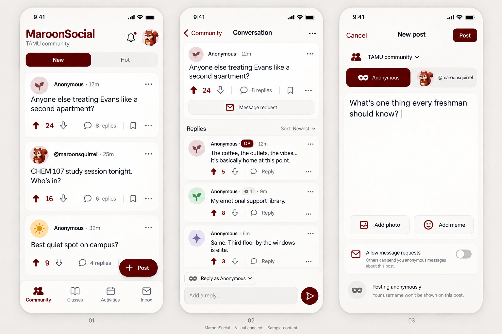

## 2. Classes: course list, CHEM 107 chat, study group

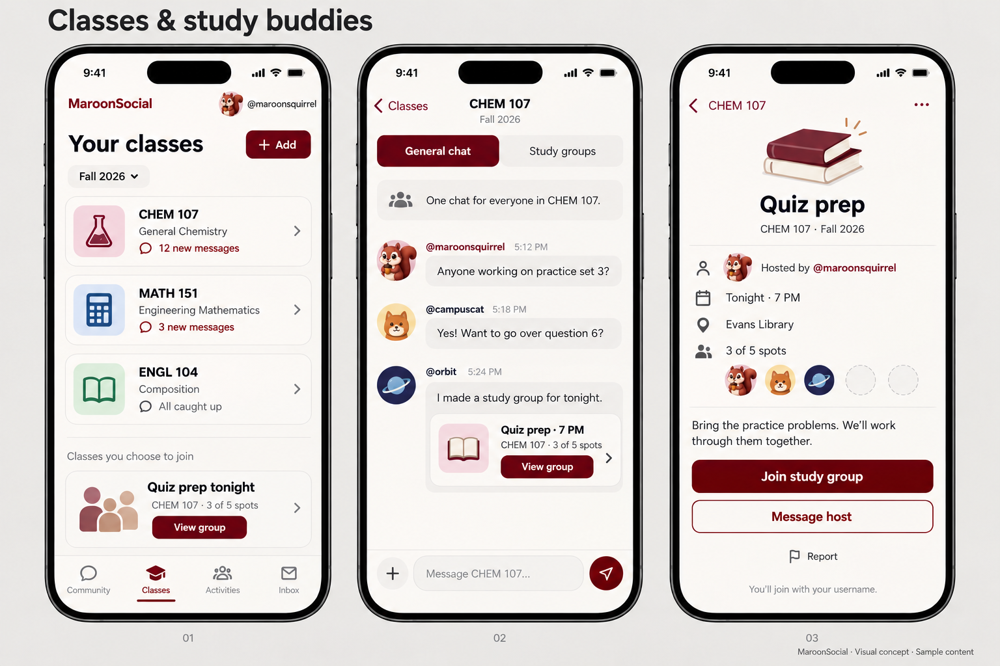

## 3. Tag: lobby, seeker compass, hider view

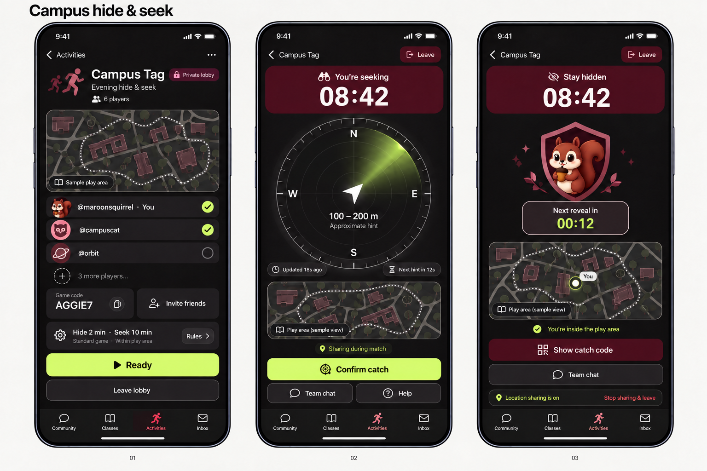

## 4. Activities: discovery, recreation, game-day countdown

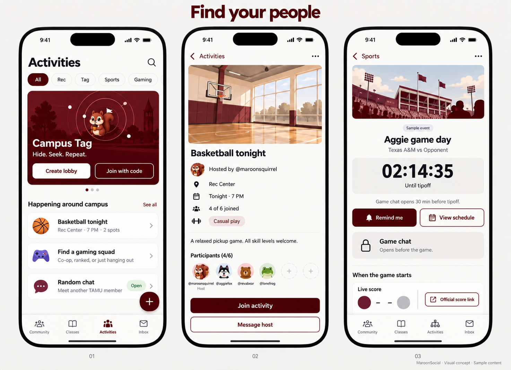

## 5. Messages: DMs, 8-ball, random text

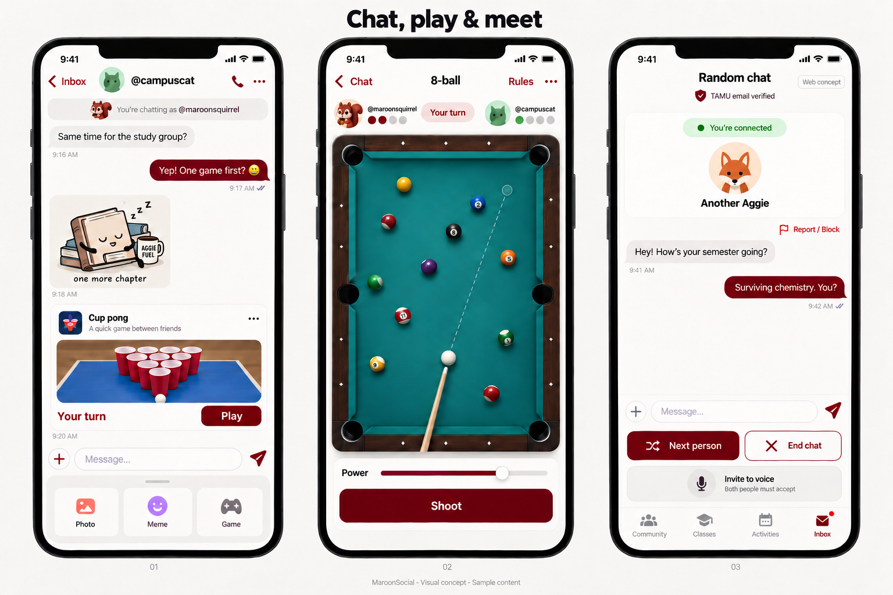

## 6. Joining: welcome, email check, unified username

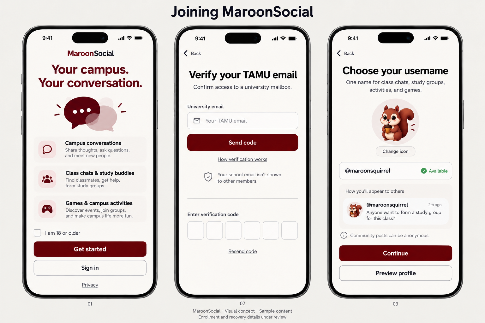

## 7. Random calls: mode selection, voice, video preview

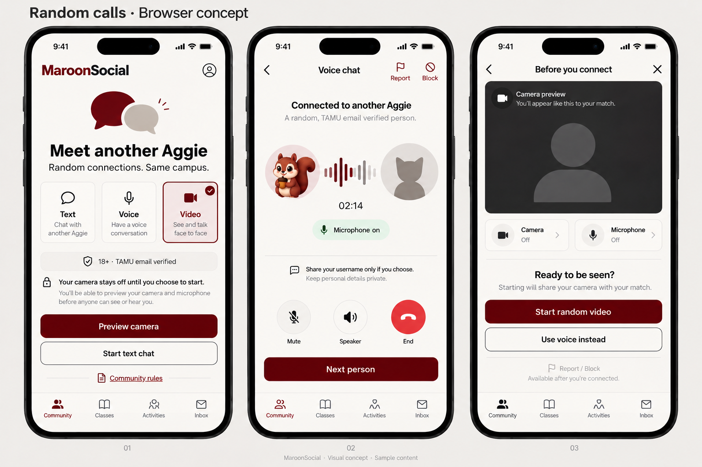

Generated with the built-in image-generation tool. [Original prompts](PROMPTS.md). [Squirrel edit prompts](SQUIRREL-EDIT-PROMPTS.md). [WebRTC cost and hosting answer](../WEBRTC-OPTION.md).

## Design review notes

The boards establish hierarchy and visual direction. Final production design should normalize icons, avatar style, active-tab states, and button dimensions across screens. A host viewing their own activity would see Manage rather than Join; the sample activity screens illustrate the participant layout. Camera preview must clearly distinguish local preview from sharing with a match. Age and recovery verification need their own complete flow after product decisions; a checkbox alone is not asserted to establish age.

## Latest additions

## 1. Hangouts: discover, browse, join

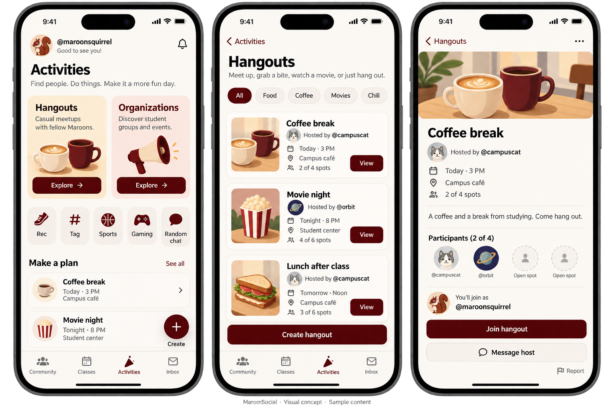

## 2. Verified organizations: directory, profile, events

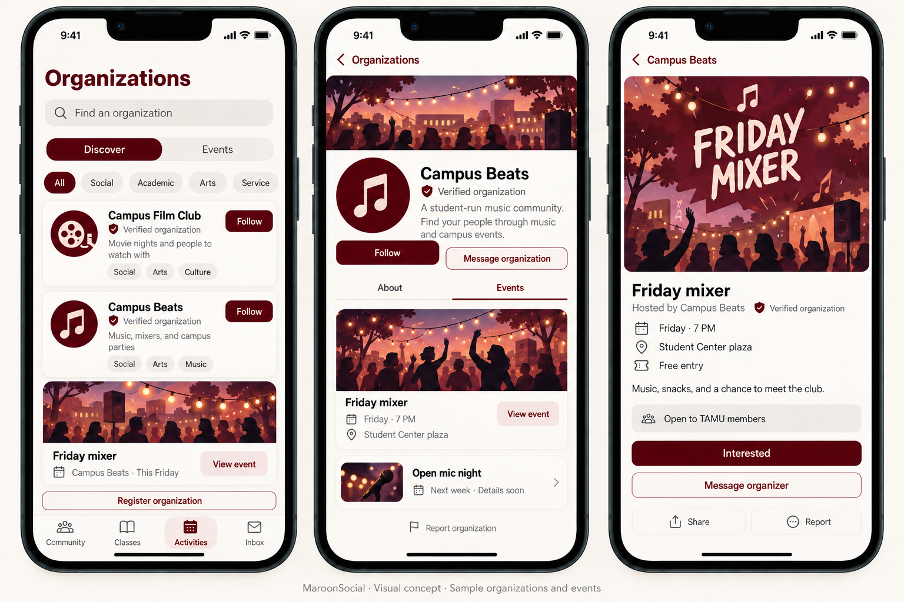

## 3. Organization promotion: manage, compose, publish

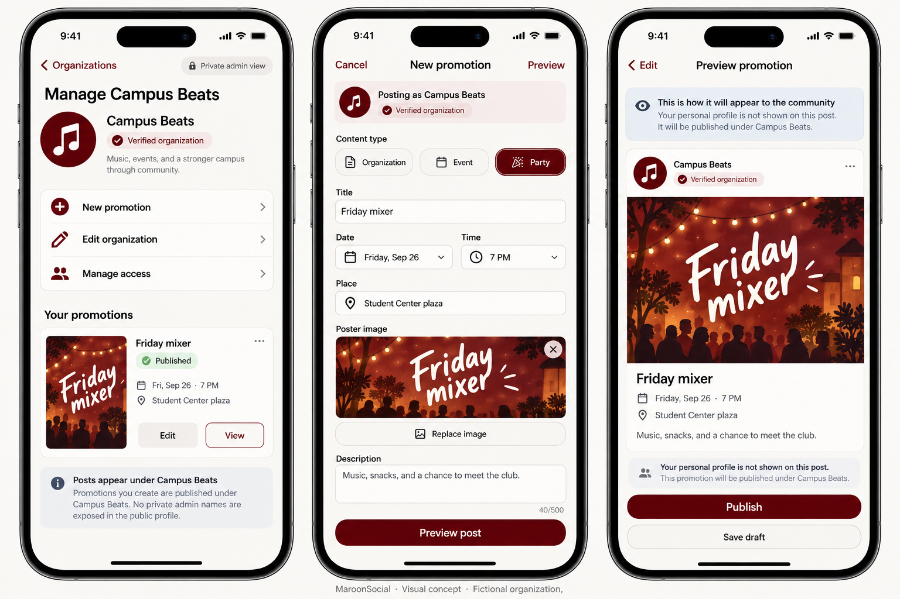

## 4. NSFW: beneath Texas A&M, optional entry, non-explicit feed

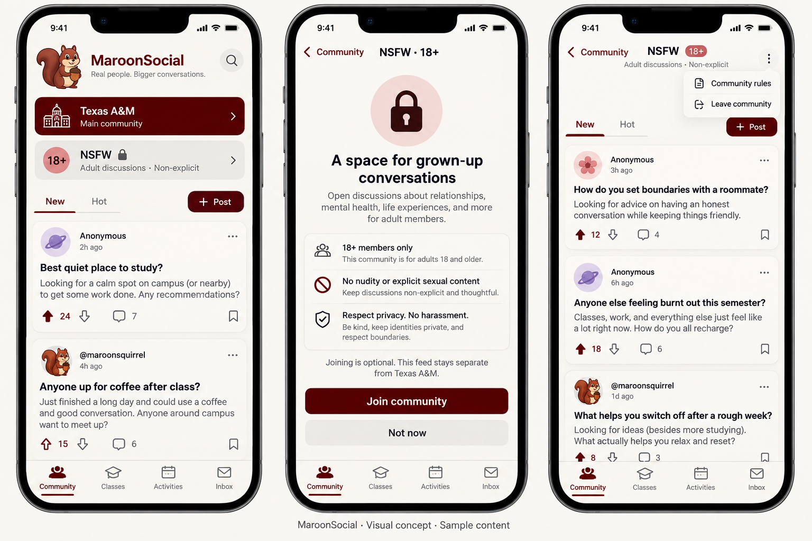

## 5. Messages: one image or GIF, replacement controls, GIF picker

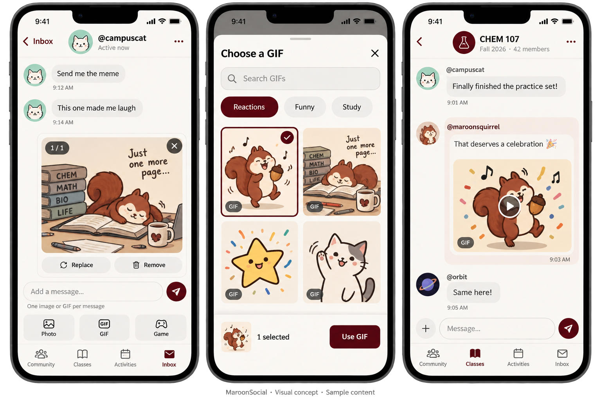

